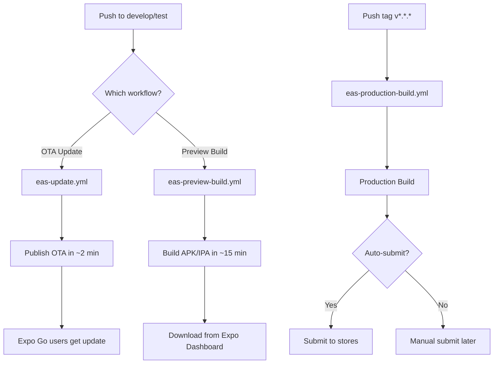

# GitHub Actions Workflows - Slow Spot App

Automatyczne pipelines do buildowania i deploymentu aplikacji mobilnej.

## 📁 Workflows

### 1. `eas-preview-build.yml` - Preview/Test Builds
**Kiedy uruchamia się:**
- Automatycznie przy push na: `develop`, `test`, `feature/*`, `claude/*`
- Ręcznie przez GitHub UI (workflow_dispatch)

**Co robi:**
- Buduje APK dla Android (można instalować bezpośrednio)
- Buduje IPA dla iOS (do TestFlight lub AdHoc)
- Nie czeka na zakończenie (non-blocking)
- Dodaje komentarz do PR z linkiem do buildu

**Użycie ręczne:**
1. Idź do Actions → "EAS Preview Build (Test Deployment)"
2. Kliknij "Run workflow"
3. Wybierz platformę (all/ios/android)
4. Sprawdź progress na Expo Dashboard

---

### 2. `eas-production-build.yml` - Production Builds
**Kiedy uruchamia się:**
- Automatycznie przy tworzeniu tagu `v*.*.*` (np. v1.0.0)
- Ręcznie przez GitHub UI (workflow_dispatch)

**Co robi:**
- Buduje AAB dla Android (Google Play)
- Buduje IPA dla iOS (App Store)
- Opcjonalnie auto-submit do stores
- Tworzy GitHub Release z linkami

**Użycie:**
```bash
# Stwórz tag i push
git tag v1.0.0
git push origin v1.0.0
```

Lub ręcznie przez GitHub UI z opcją auto-submit.

---

### 3. `eas-update.yml` - OTA Updates (Expo Go)
**Kiedy uruchamia się:**
- Automatycznie przy push na: `develop`, `test`
- Ręcznie przez GitHub UI (workflow_dispatch)

**Co robi:**
- Publikuje over-the-air (OTA) update
- Natychmiastowa aktualizacja dla użytkowników Expo Go
- Generuje QR code do testowania
- BEZ rebuildu aplikacji (2-5 minut)

**Idealne do:**
- Szybkich testów UI/UX
- Iteracyjnego developmentu
- Hotfixes dla JS/TS code

---

## 🔧 Setup

### Wymagane GitHub Secrets

Dodaj w `Settings → Secrets and variables → Actions`:

| Secret Name | Opis | Jak uzyskać |
|-------------|------|-------------|
| `EXPO_TOKEN` | **WYMAGANY** - Token autoryzacyjny Expo | `npx expo token:create` |
| `APPLE_ID` | Opcjonalny - Apple ID dla auto-submit | Twój Apple ID email |
| `APPLE_TEAM_ID` | Opcjonalny - Apple Team ID | App Store Connect |
| `GOOGLE_SERVICE_ACCOUNT` | Opcjonalny - Google Play credentials | Google Play Console |

### Quick Setup (3 minuty)

```bash
# 1. Zaloguj się do Expo
cd mobile
npx expo login

# 2. Wygeneruj token
npx expo token:create

# 3. Dodaj do GitHub Secrets
# Skopiuj token i dodaj jako EXPO_TOKEN w GitHub Settings

# 4. Test!
git checkout develop
git commit --allow-empty -m "test: trigger build"
git push
```

Lub użyj automatycznego skryptu:
```bash
./scripts/setup-deployment.sh
```

---

## 🚀 Przykłady użycia

### Szybki test UI (2-5 minut)
```bash
git checkout develop
# ... zrób zmiany ...
git commit -am "feat: update UI"
git push
# → Automatyczny OTA update! Testerzy z Expo Go dostaną natychmiast
```

### Build testowy dla zewnętrznych (15-20 minut)
```bash
git checkout test
git merge develop
git push
# → Automatyczny preview build
# → Sprawdź status: https://expo.dev/accounts/leszekszpunar/projects/slow-spot/builds
# → Pobierz APK/IPA i wyślij testerom
```

### Release produkcyjny
```bash
git checkout main
git merge develop
git tag v1.0.0
git push origin v1.0.0
# → Production build + optional auto-submit
# → GitHub Release created automatically
```

### Manual trigger (GitHub UI)
1. Idź do **Actions** tab
2. Wybierz workflow (np. "EAS Preview Build")
3. Kliknij **"Run workflow"**
4. Wypełnij parametry:
   - **platform**: `all`, `ios`, lub `android`
   - **submit** (tylko production): `true` dla auto-submit
5. Kliknij **"Run workflow"**

---

## 📊 Monitoring

### Expo Dashboard
https://expo.dev/accounts/leszekszpunar/projects/slow-spot/builds

Zobaczysz:
- Status buildów (queued → in progress → finished)
- Download links (APK/IPA)
- QR codes dla Expo Go
- Build logs i errors

### GitHub Actions
https://github.com/Slow-Spot/app/actions

Zobaczysz:
- Wszystkie workflow runs
- Detailed logs
- Artifacts (jeśli są)
- Errors i warnings

---

## 🔄 Workflow Logic



---

## 🚨 Troubleshooting

### Build fails: "Missing EXPO_TOKEN"
```bash
# Sprawdź czy secret istnieje
gh secret list

# Jeśli nie ma, dodaj:
npx expo token:create
gh secret set EXPO_TOKEN
# [paste token]
```

### Build fails: "Invalid credentials"
```bash
cd mobile
eas credentials
# Reconfigure Apple/Google credentials
```

### Workflow nie uruchamia się
1. Sprawdź czy branch name pasuje do trigger patterns
2. Sprawdź czy workflows są enabled w GitHub Settings
3. Sprawdź GitHub Actions logs dla szczegółów

### OTA update nie działa
- Sprawdź czy używasz Expo Go (nie development build)
- Sprawdź czy branch jest prawidłowy (preview/production)
- Wyczyść cache: `eas update --branch preview --clear`

---

## 💡 Best Practices

1. **Development → Test → Production**
   - Develop: Szybkie zmiany z OTA updates
   - Test: Preview builds dla zespołu
   - Production: Finalne buildy przed release

2. **Use semantic versioning**
   - `v1.0.0` - Major release
   - `v1.1.0` - Minor features
   - `v1.0.1` - Patches

3. **Tag production releases**
   ```bash
   git tag -a v1.0.0 -m "Release 1.0.0 - Initial launch"
   git push origin v1.0.0
   ```

4. **Monitor builds**
   - Sprawdzaj Expo Dashboard regularnie
   - Subscribe do Expo notifications

5. **Test before production**
   - Zawsze testuj preview build przed production
   - Użyj TestFlight/Internal Testing

---

## 📖 Więcej informacji

- **Główna dokumentacja**: `../DEPLOYMENT_PIPELINES.md`
- **Mobile app guide**: `../mobile/DEPLOYMENT.md`
- **EAS Build docs**: https://docs.expo.dev/build/introduction/
- **GitHub Actions docs**: https://docs.github.com/actions

---

**Gotowe do użycia! 🚀**

Po setupie `EXPO_TOKEN`, wszystko działa automatycznie przy każdym push!
