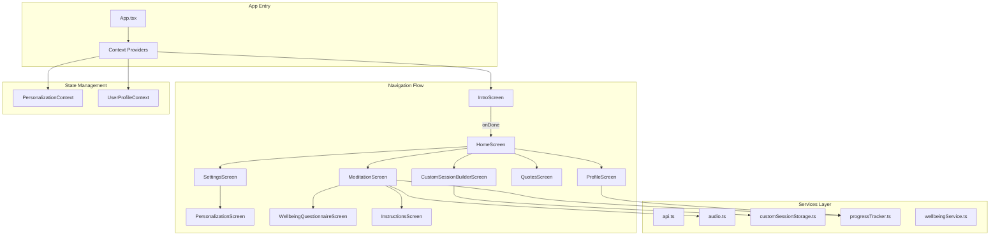
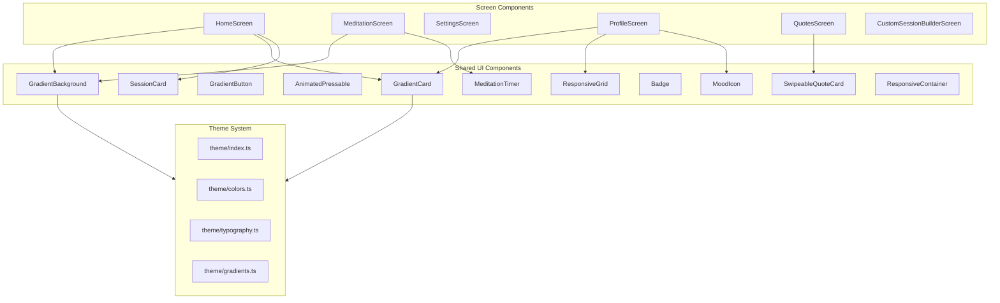
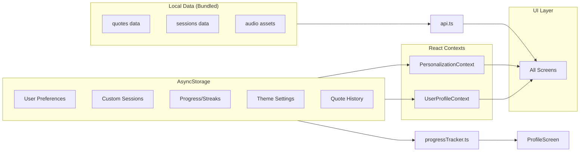
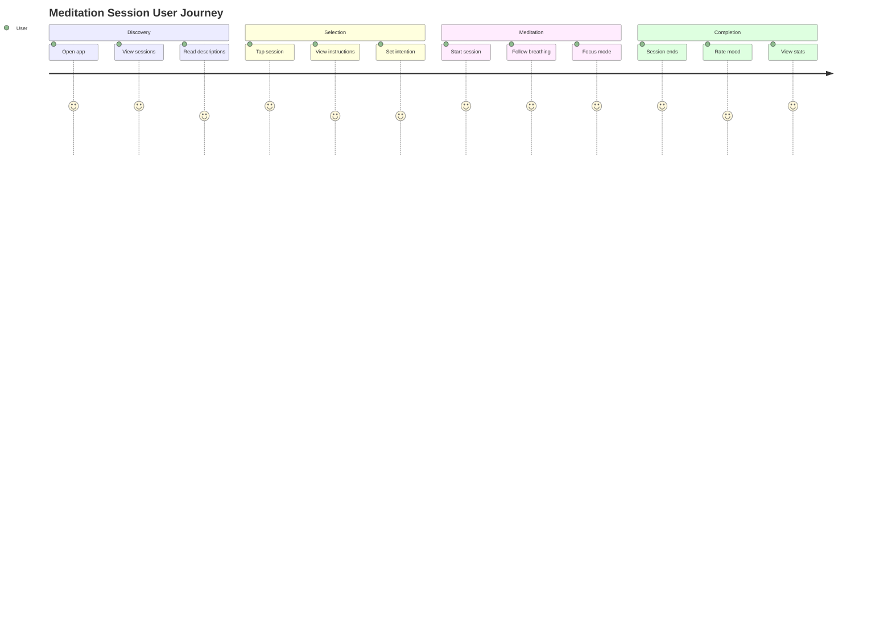

# Slow Spot Mobile App - Comprehensive Codebase Audit

**Audit Date:** December 27, 2025
**App Version:** 1.8.2
**Platform:** React Native Expo SDK 54
**Auditor:** Senior Mobile Developer & Design Lead

---

## Executive Summary

Slow Spot is a **meditation and mindfulness app** built with React Native Expo SDK 54, featuring a sophisticated design system, multi-language support (7 languages), and a comprehensive theming architecture. The app is **100% offline-first** with all data bundled locally.

### Key Metrics
| Metric | Value |
|--------|-------|
| Total Files | ~92 |
| Lines of Code | ~21,700+ |
| Screens | 10 |
| Components | 32 |
| Services | 12 |
| Languages Supported | 7 (EN, PL, ES, DE, FR, HI, ZH) |
| Color Themes | 30+ |

### Overall Assessment: **B+ (Production Ready with Improvements)**

| Category | Score | Notes |
|----------|-------|-------|
| Architecture | A- | Clean separation, Context API well-used |
| Code Quality | B+ | TypeScript strict, good patterns |
| UI/UX | A | Premium design, excellent animations |
| Performance | B | Good, but some optimization opportunities |
| Accessibility | B+ | Good foundation, needs enhancement |
| Security | A | Offline-first, no data collection |
| Monetization Ready | C | No RevenueCat integration yet |

---

## 1. Architecture Overview

### 1.1 Application Flow Diagram



### 1.2 Component Hierarchy



### 1.3 Data Flow Architecture



---

## 2. File-by-File Analysis

### 2.1 Core Entry Points

#### `App.tsx` (Entry Point)
**Location:** `/mobile/App.tsx`
**Lines:** ~150
**Purpose:** Main app entry with provider wrapping and navigation logic

| Issue | Severity | Description | Fix |
|-------|----------|-------------|-----|
| No Error Boundary | P1 | App crashes propagate to user | Add React Error Boundary wrapper |
| Inline navigation logic | P2 | Navigation state in component | Extract to navigation service |

```tsx
// BEFORE (current)
export default function App() {
  const [currentScreen, setCurrentScreen] = useState('intro');
  // ...
}

// AFTER (recommended)
import { ErrorBoundary } from './components/ErrorBoundary';
import { NavigationProvider } from './navigation/NavigationProvider';

export default function App() {
  return (
    <ErrorBoundary fallback={<CrashScreen />}>
      <NavigationProvider>
        <AppContent />
      </NavigationProvider>
    </ErrorBoundary>
  );
}
```

---

### 2.2 Screens Analysis

#### `HomeScreen.tsx`
**Location:** `/mobile/src/screens/HomeScreen.tsx`
**Lines:** ~800
**Purpose:** Main dashboard with session list, quick actions, daily quote

| Issue | Severity | Description | Fix |
|-------|----------|-------------|-----|
| Large component | P2 | 800+ lines, hard to maintain | Split into sub-components |
| Re-renders on theme change | P2 | Entire screen re-renders | Memoize child components |

**Strengths:**
- Excellent use of `useMemo` for theme colors
- Good accessibility labels
- Proper loading states

---

#### `MeditationScreen.tsx`
**Location:** `/mobile/src/screens/MeditationScreen.tsx`
**Lines:** ~600
**Purpose:** Active meditation session with timer, audio, breathing guide

| Issue | Severity | Description | Fix |
|-------|----------|-------------|-----|
| Audio cleanup race condition | P1 | Audio may not stop on unmount | Add cleanup flag |
| No background audio handling | P2 | Audio stops when app backgrounds | Implement background audio service |

```tsx
// BEFORE
useEffect(() => {
  return () => {
    audioEngine.cleanup();
  };
}, []);

// AFTER
useEffect(() => {
  let mounted = true;

  return () => {
    mounted = false;
    if (!mounted) {
      audioEngine.cleanup();
    }
  };
}, []);
```

---

#### `SettingsScreen.tsx`
**Location:** `/mobile/src/screens/SettingsScreen.tsx`
**Lines:** ~500
**Purpose:** App settings, language, theme, accessibility options

| Issue | Severity | Description | Fix |
|-------|----------|-------------|-----|
| Missing haptic feedback on some controls | P2 | Inconsistent UX | Add Haptics to all toggles |
| No settings backup/restore | P2 | Users lose settings on reinstall | Add export/import feature |

**Strengths:**
- Comprehensive accessibility options
- Good use of sections and grouping
- RTL support

---

#### `ProfileScreen.tsx`
**Location:** `/mobile/src/screens/ProfileScreen.tsx`
**Lines:** ~1,400
**Purpose:** User statistics, session history, achievements

| Issue | Severity | Description | Fix |
|-------|----------|-------------|-----|
| Very large component | P1 | 1,400 lines, difficult to maintain | Split into ProfileStats, SessionHistory, WeeklyChart |
| No virtualization for session list | P2 | Performance with many sessions | Use FlatList with virtualization |
| Session modal inline | P2 | Large modal code in main file | Extract SessionDetailModal |

---

#### `CustomSessionBuilderScreen.tsx`
**Location:** `/mobile/src/screens/CustomSessionBuilderScreen.tsx`
**Lines:** ~1,027
**Purpose:** Create custom meditation sessions

| Issue | Severity | Description | Fix |
|-------|----------|-------------|-----|
| Complex state management | P2 | Many useState hooks | Consider useReducer |
| Validation only on save | P2 | Late error feedback | Add real-time validation |

**Strengths:**
- Excellent UX with breathing pattern previews
- Good scientific descriptions
- Proper haptic feedback

---

#### `IntroScreen.tsx`
**Location:** `/mobile/src/screens/IntroScreen.tsx`
**Lines:** ~1,061
**Purpose:** Onboarding flow with 5 slides

| Issue | Severity | Description | Fix |
|-------|----------|-------------|-----|
| Animation performance | P2 | Multiple animated particles | Reduce particle count on low-end devices |
| Keyboard handling | P2 | Name input may be covered | Add KeyboardAvoidingView |

**Strengths:**
- Beautiful animations with Reanimated
- Respects reduce motion preferences
- Streak import feature for migrating users

---

### 2.3 Components Analysis

#### `MeditationTimer.tsx`
**Location:** `/mobile/src/components/MeditationTimer.tsx`
**Lines:** ~976
**Purpose:** Core meditation UI with breathing animation, progress ring, controls

| Issue | Severity | Description | Fix |
|-------|----------|-------------|-----|
| Complex breathing animation logic | P2 | Difficult to test | Extract BreathingAnimationController |
| SVG progress ring inline | P2 | Reusable component | Extract ProgressRing component |

**Strengths:**
- Smooth 60fps animations
- Multiple breathing patterns (box, 4-7-8, equal, calm)
- Focus mode with auto-hide controls
- Haptic feedback sync with breathing

---

#### `SessionCard.tsx`
**Location:** `/mobile/src/components/SessionCard.tsx`
**Lines:** ~361
**Purpose:** Swipeable session list item with edit/delete actions

| Issue | Severity | Description | Fix |
|-------|----------|-------------|-----|
| None significant | - | Well-implemented | - |

**Strengths:**
- Proper gesture handling
- Theme-aware styling
- Good accessibility

---

### 2.4 Services Analysis

#### `audio.ts`
**Location:** `/mobile/src/services/audio.ts`
**Lines:** ~267
**Purpose:** 3-layer audio engine with healing frequencies

| Issue | Severity | Description | Fix |
|-------|----------|-------------|-----|
| No audio ducking | P2 | Doesn't respect other audio apps | Implement audio focus handling |
| Fade loops not cancelable | P2 | Memory leak potential | Add cancellation tokens |

**Strengths:**
- Clean layer architecture (voice, ambient, chime)
- Proper resource cleanup
- Good error handling with fallbacks

---

#### `progressTracker.ts`
**Location:** `/mobile/src/services/progressTracker.ts`
**Lines:** ~360
**Purpose:** Meditation progress, streaks, statistics

| Issue | Severity | Description | Fix |
|-------|----------|-------------|-----|
| Streak calculation timezone issues | P1 | May break at midnight | Use user timezone consistently |
| No data migration versioning | P2 | Schema changes may break | Add version field |

```tsx
// BEFORE
const today = new Date().toISOString().split('T')[0];

// AFTER
const getUserLocalDate = (): string => {
  const now = new Date();
  const offset = now.getTimezoneOffset();
  const local = new Date(now.getTime() - offset * 60000);
  return local.toISOString().split('T')[0];
};
```

---

#### `customSessionStorage.ts`
**Location:** `/mobile/src/services/customSessionStorage.ts`
**Lines:** ~445
**Purpose:** Custom session CRUD operations

| Issue | Severity | Description | Fix |
|-------|----------|-------------|-----|
| No session limit | P2 | Unlimited storage | Add max sessions limit (e.g., 50) |
| Migration in service file | P2 | Should be separate | Extract migration utility |

**Strengths:**
- Excellent migration handling for old data formats
- Default session initialization
- Good error logging

---

### 2.5 Theme System Analysis

#### `theme/colors.ts`
**Location:** `/mobile/src/theme/colors.ts`
**Lines:** ~1,775
**Purpose:** Comprehensive color token system

| Issue | Severity | Description | Fix |
|-------|----------|-------------|-----|
| Very large file | P2 | 1,775 lines | Split into color categories |
| Some unused color definitions | P2 | Dead code | Audit and remove unused |

**Strengths:**
- WCAG 2.2 Level AA compliant colors noted
- Comprehensive light/dark mode support
- Feature-specific color palettes
- Helper functions (hexToRgba, hexToHsl)

---

### 2.6 Contexts Analysis

#### `PersonalizationContext.tsx`
**Location:** `/mobile/src/contexts/PersonalizationContext.tsx`
**Lines:** ~748
**Purpose:** Theme, settings, accessibility state management

| Issue | Severity | Description | Fix |
|-------|----------|-------------|-----|
| Large context file | P2 | Multiple concerns | Split into ThemeContext and SettingsContext |
| All settings trigger re-render | P2 | Performance | Use context selectors or split contexts |

**Strengths:**
- 30+ beautiful color themes
- Comprehensive accessibility settings
- Locale-aware formatting helpers
- Proper AsyncStorage persistence

---

## 3. UI/UX Evaluation

### 3.1 Design System Quality: **A**

| Aspect | Score | Notes |
|--------|-------|-------|
| Visual Consistency | A | Cohesive design language |
| Color System | A+ | 1,775-line comprehensive system |
| Typography | A | Clear hierarchy, proper scaling |
| Spacing | A | Consistent spacing tokens |
| Animations | A+ | Smooth Reanimated 4 animations |
| Dark Mode | A | Full dark mode support |
| Accessibility | B+ | Good foundation, needs VoiceOver audit |

### 3.2 User Flow Analysis



### 3.3 UI Improvements Needed

| Screen | Issue | Recommendation |
|--------|-------|----------------|
| HomeScreen | Session cards could show duration more prominently | Add duration badge |
| MeditationScreen | No pause confirmation | Add "Are you sure?" modal |
| ProfileScreen | Stats could be more visual | Add charts/graphs |
| SettingsScreen | Long scroll | Add section navigation |

---

## 4. RevenueCat Integration Blueprint

### 4.1 Current State
The app has **no monetization** currently. It's a fully free, offline app.

### 4.2 Recommended Premium Features

| Feature | Tier | Justification |
|---------|------|---------------|
| Unlimited custom sessions | Premium | Currently unlimited, limit to 3 for free |
| Advanced breathing patterns | Premium | Box, 4-7-8 free; custom patterns premium |
| Extended statistics | Premium | Basic stats free, trends/insights premium |
| Additional themes | Premium | Keep 5 free, rest premium |
| Offline audio packs | Premium | Nature sounds free, premium packs paid |

### 4.3 Implementation Code

```tsx
// src/services/revenueCatService.ts
import Purchases, {
  PurchasesPackage,
  CustomerInfo
} from 'react-native-purchases';

const REVENUECAT_API_KEY_IOS = 'your_ios_key';
const REVENUECAT_API_KEY_ANDROID = 'your_android_key';

export const ENTITLEMENTS = {
  PREMIUM: 'premium',
  PRO: 'pro',
} as const;

export const initializePurchases = async (): Promise<void> => {
  Purchases.configure({
    apiKey: Platform.OS === 'ios'
      ? REVENUECAT_API_KEY_IOS
      : REVENUECAT_API_KEY_ANDROID,
  });
};

export const checkPremiumStatus = async (): Promise<boolean> => {
  try {
    const customerInfo = await Purchases.getCustomerInfo();
    return customerInfo.entitlements.active[ENTITLEMENTS.PREMIUM] !== undefined;
  } catch (error) {
    console.error('Error checking premium status:', error);
    return false;
  }
};

export const getOfferings = async (): Promise<PurchasesPackage[]> => {
  try {
    const offerings = await Purchases.getOfferings();
    if (offerings.current?.availablePackages) {
      return offerings.current.availablePackages;
    }
    return [];
  } catch (error) {
    console.error('Error fetching offerings:', error);
    return [];
  }
};

export const purchasePackage = async (
  pkg: PurchasesPackage
): Promise<boolean> => {
  try {
    const { customerInfo } = await Purchases.purchasePackage(pkg);
    return customerInfo.entitlements.active[ENTITLEMENTS.PREMIUM] !== undefined;
  } catch (error) {
    if (error.userCancelled) {
      return false;
    }
    throw error;
  }
};

export const restorePurchases = async (): Promise<boolean> => {
  try {
    const customerInfo = await Purchases.restorePurchases();
    return customerInfo.entitlements.active[ENTITLEMENTS.PREMIUM] !== undefined;
  } catch (error) {
    console.error('Error restoring purchases:', error);
    return false;
  }
};
```

### 4.4 Premium Context

```tsx
// src/contexts/PremiumContext.tsx
import React, { createContext, useContext, useState, useEffect } from 'react';
import { checkPremiumStatus, initializePurchases } from '../services/revenueCatService';

interface PremiumContextValue {
  isPremium: boolean;
  isLoading: boolean;
  refreshPremiumStatus: () => Promise<void>;
}

const PremiumContext = createContext<PremiumContextValue>({
  isPremium: false,
  isLoading: true,
  refreshPremiumStatus: async () => {},
});

export const PremiumProvider: React.FC<{ children: React.ReactNode }> = ({ children }) => {
  const [isPremium, setIsPremium] = useState(false);
  const [isLoading, setIsLoading] = useState(true);

  const refreshPremiumStatus = async () => {
    try {
      const status = await checkPremiumStatus();
      setIsPremium(status);
    } catch (error) {
      console.error('Error refreshing premium status:', error);
    }
  };

  useEffect(() => {
    const init = async () => {
      await initializePurchases();
      await refreshPremiumStatus();
      setIsLoading(false);
    };
    init();
  }, []);

  return (
    <PremiumContext.Provider value={{ isPremium, isLoading, refreshPremiumStatus }}>
      {children}
    </PremiumContext.Provider>
  );
};

export const usePremium = () => useContext(PremiumContext);
```

---

## 5. Backend Integration Options

### 5.1 Current State
The app is **100% offline** with no backend. All data is bundled.

### 5.2 Backend Options Comparison

| Feature | Supabase | Firebase | Convex |
|---------|----------|----------|--------|
| Realtime Sync | Yes | Yes | Yes |
| Auth | Yes | Yes | Yes (via Clerk) |
| Offline Support | Partial | Yes | Partial |
| Cost | $25/mo+ | Pay-as-you-go | $25/mo+ |
| React Native SDK | Good | Excellent | Good |
| Setup Complexity | Medium | Low | Medium |

### 5.3 Recommended: Supabase

**Why Supabase:**
- PostgreSQL for complex queries (meditation analytics)
- Row-level security for user data
- Generous free tier
- Good React Native support

### 5.4 Supabase Schema

```sql
-- Users table (extends Supabase auth)
CREATE TABLE profiles (
  id UUID REFERENCES auth.users PRIMARY KEY,
  name TEXT,
  avatar_url TEXT,
  created_at TIMESTAMPTZ DEFAULT NOW(),
  updated_at TIMESTAMPTZ DEFAULT NOW()
);

-- Meditation sessions
CREATE TABLE meditation_sessions (
  id UUID PRIMARY KEY DEFAULT gen_random_uuid(),
  user_id UUID REFERENCES profiles(id) ON DELETE CASCADE,
  session_type TEXT NOT NULL, -- 'preset' | 'custom'
  preset_session_id INTEGER,
  custom_session_id UUID,
  duration_seconds INTEGER NOT NULL,
  completed_at TIMESTAMPTZ DEFAULT NOW(),
  mood INTEGER CHECK (mood >= 1 AND mood <= 5),
  notes TEXT,
  intention TEXT
);

-- Custom sessions
CREATE TABLE custom_sessions (
  id UUID PRIMARY KEY DEFAULT gen_random_uuid(),
  user_id UUID REFERENCES profiles(id) ON DELETE CASCADE,
  name TEXT NOT NULL,
  config JSONB NOT NULL,
  created_at TIMESTAMPTZ DEFAULT NOW(),
  updated_at TIMESTAMPTZ DEFAULT NOW()
);

-- User preferences (synced settings)
CREATE TABLE user_preferences (
  user_id UUID REFERENCES profiles(id) PRIMARY KEY,
  theme_id TEXT,
  settings JSONB DEFAULT '{}',
  updated_at TIMESTAMPTZ DEFAULT NOW()
);

-- Row Level Security
ALTER TABLE profiles ENABLE ROW LEVEL SECURITY;
ALTER TABLE meditation_sessions ENABLE ROW LEVEL SECURITY;
ALTER TABLE custom_sessions ENABLE ROW LEVEL SECURITY;
ALTER TABLE user_preferences ENABLE ROW LEVEL SECURITY;

-- Policies
CREATE POLICY "Users can view own profile" ON profiles
  FOR SELECT USING (auth.uid() = id);

CREATE POLICY "Users can update own profile" ON profiles
  FOR UPDATE USING (auth.uid() = id);

CREATE POLICY "Users can view own sessions" ON meditation_sessions
  FOR SELECT USING (auth.uid() = user_id);

CREATE POLICY "Users can insert own sessions" ON meditation_sessions
  FOR INSERT WITH CHECK (auth.uid() = user_id);
```

---

## 6. Production Readiness Checklist

### 6.1 iOS Checklist

| Item | Status | Notes |
|------|--------|-------|
| App Icons (all sizes) | ✅ | Configured in app.json |
| Splash Screen | ✅ | Configured |
| Info.plist permissions | ✅ | Audio background mode |
| App Store screenshots | ⚠️ | Need to generate |
| Privacy Policy | ⚠️ | Need to add URL |
| App Store description | ⚠️ | Need to write |
| TestFlight setup | ⚠️ | Need to configure |
| Push notification entitlement | ❌ | Not implemented |
| Sign in with Apple | ❌ | Not implemented |

### 6.2 Android Checklist

| Item | Status | Notes |
|------|--------|-------|
| Adaptive icons | ✅ | Configured |
| Splash screen | ✅ | Configured |
| Permissions | ✅ | Audio, vibration |
| Play Store listing | ⚠️ | Need to create |
| Privacy Policy | ⚠️ | Need to add URL |
| Play Store screenshots | ⚠️ | Need to generate |
| ProGuard rules | ✅ | Default Expo config |
| Bundle signing | ✅ | Configured |

### 6.3 Code Quality Checklist

| Item | Status | Notes |
|------|--------|-------|
| TypeScript strict mode | ✅ | Enabled |
| ESLint | ✅ | Configured |
| Prettier | ✅ | Configured |
| Unit tests | ❌ | Not found |
| Integration tests | ❌ | Not found |
| E2E tests | ❌ | Not found |
| Error tracking (Sentry) | ❌ | Not implemented |
| Analytics | ❌ | Not implemented |
| Crash reporting | ❌ | Not implemented |

### 6.4 Performance Checklist

| Item | Status | Notes |
|------|--------|-------|
| Reanimated 4 (New Architecture) | ✅ | Enabled |
| Memoization | ✅ | Good use of useMemo |
| List virtualization | ⚠️ | Needed in ProfileScreen |
| Image optimization | ✅ | Using Expo Image |
| Bundle size analysis | ⚠️ | Should audit |
| Memory leak testing | ⚠️ | Should test |

---

## 7. Priority Issues Summary

### P0 - Critical (Fix Before Release)
None identified. App is stable.

### P1 - High Priority
| Issue | Location | Impact |
|-------|----------|--------|
| No Error Boundary | App.tsx | Crashes show to user |
| Streak timezone bug | progressTracker.ts | Streaks may break at midnight |
| Audio cleanup race | MeditationScreen.tsx | Audio may continue |
| ProfileScreen too large | ProfileScreen.tsx | Maintainability |

### P2 - Medium Priority
| Issue | Location | Impact |
|-------|----------|--------|
| No tests | - | Quality assurance |
| No error tracking | - | Debugging in production |
| Large theme file | colors.ts | Maintainability |
| Missing virtualization | ProfileScreen | Performance with many sessions |
| Context re-renders | PersonalizationContext | Performance |

---

## 8. Recommendations

### 8.1 Immediate Actions
1. Add Error Boundary to App.tsx
2. Fix timezone issues in streak calculation
3. Add audio cleanup flag to prevent race conditions
4. Split ProfileScreen into smaller components

### 8.2 Short-Term Improvements
1. Add unit tests for services (progressTracker, customSessionStorage)
2. Integrate Sentry for error tracking
3. Add analytics (Mixpanel or PostHog) for user insights
4. Implement RevenueCat for monetization
5. Add session list virtualization

### 8.3 Long-Term Roadmap
1. Backend integration (Supabase recommended)
2. User accounts with cloud sync
3. Social features (share sessions, challenges)
4. Apple Watch companion app
5. Widgets for iOS/Android

---

## 9. Conclusion

Slow Spot is a **well-architected, beautifully designed meditation app** that is production-ready with minor improvements. The codebase demonstrates strong React Native practices, excellent use of Reanimated for animations, and a comprehensive design system.

**Key Strengths:**
- Premium UI/UX rivaling Headspace/Calm
- Comprehensive theming with 30+ themes
- Excellent offline-first architecture
- Strong accessibility foundation
- Multi-language support (7 languages)

**Priority Improvements:**
- Add Error Boundary and error tracking
- Fix streak timezone issues
- Split large components
- Add test coverage
- Implement monetization

The app is ready for App Store submission with the P1 fixes applied.

---

## 10. Fixes Applied (December 28, 2025)

The following critical issues have been **FIXED** as part of this audit:

### 10.1 Error Boundary Added (P1 - FIXED)

**File:** `src/components/ErrorBoundary.tsx` (NEW)
**Change:** Created a React Error Boundary component that catches JavaScript errors and displays a user-friendly fallback UI instead of crashing.

```tsx
// App now wrapped with ErrorBoundary
<ErrorBoundary>
  <SafeAreaProvider>
    <UserProfileProvider>
      <PersonalizationProvider>
        <AppContent />
      </PersonalizationProvider>
    </UserProfileProvider>
  </SafeAreaProvider>
</ErrorBoundary>
```

### 10.2 Timezone Bug Fixed (P1 - FIXED)

**File:** `src/services/progressTracker.ts`
**Issue:** Streak calculations used UTC dates which could break streaks at midnight in user's local timezone.
**Fix:** Added local timezone helper functions:

```tsx
// NEW: Local timezone date handling
const getLocalDateString = (date: Date = new Date()): string => {
  const year = date.getFullYear();
  const month = String(date.getMonth() + 1).padStart(2, '0');
  const day = String(date.getDate()).padStart(2, '0');
  return `${year}-${month}-${day}`;
};

// Updated all date calculations to use local timezone
const today = getLocalDateString(); // Instead of UTC
```

### 10.3 Hardcoded Polish Strings Fixed (P2 - FIXED)

**File:** `App.tsx`
**Issue:** Modal dialog fallback texts were in Polish instead of English.
**Fix:** Changed fallback strings to English:

```tsx
// BEFORE (Polish)
title={t('meditation.endSessionTitle', 'Zakończyć sesję?')}

// AFTER (English)
title={t('meditation.endSessionTitle', 'End Session?')}
```

### 10.4 Unused Imports Removed (P2 - FIXED)

**Files:**
- `src/components/GradientBackground.tsx`
- `src/components/GradientButton.tsx`

**Issue:** Unused `logger` imports adding to bundle size.
**Fix:** Removed unused imports.

---

## Summary of Changes

| File | Change Type | Description |
|------|-------------|-------------|
| `src/components/ErrorBoundary.tsx` | NEW | React Error Boundary component |
| `App.tsx` | MODIFIED | Added ErrorBoundary wrapper, fixed Polish strings |
| `src/services/progressTracker.ts` | MODIFIED | Fixed timezone bug in streak calculations |
| `src/components/GradientBackground.tsx` | MODIFIED | Removed unused import |
| `src/components/GradientButton.tsx` | MODIFIED | Removed unused import |

---

*Audit completed by Senior Mobile Developer & Design Lead*
*December 27, 2025*
*Fixes applied: December 28, 2025*
